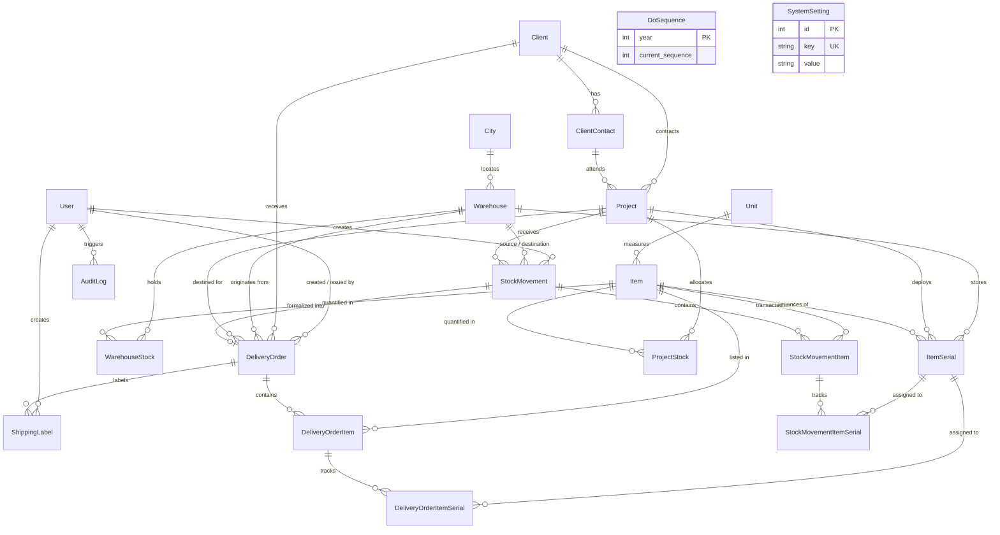

# AWMS — Database Design Document

This document outlines the data model, Entity Relationship Diagram (ERD), table structures, and relationship integrity rules for the **Asset Warehouse Management System (AWMS)** PostgreSQL database managed via Prisma ORM.

---

## 1. Entity Relationship Diagram (ERD)

---

## 2. Core Entities & Schema Reference

### 2.1 User (`users`)
Stores system operators, credentials, and access roles.
- `id` (Int, PK, autoincrement)
- `email` (String, Unique): Login credential.
- `password` (String): Bcrypt password hash (cost factor 10).
- `name` (String): Full name displayed on reports and audit logs.
- `role` (Role Enum): `SUPER_ADMIN`, `ADMIN`, `READ_ONLY`. Default: `READ_ONLY`.
- `is_active` (Boolean): Soft-disable flag.

### 2.2 Item (`items`)
Master product catalog definition.
- `id` (Int, PK, autoincrement)
- `name` (String): Item display name.
- `brand` (String, Optional): Manufacturer brand.
- `model_number` (String, Optional): Part or model number.
- `unit_id` (Int, FK -> `units.id`): Measurement unit (`pcs`, `box`, `roll`, etc.).
- `tracking_type` (TrackingType Enum):
  - `SERIALIZED`: Individual physical assets tracked with serial numbers.
  - `BULK`: Quantified consumable items without unique serials.
- `material_type` (MaterialType Enum): `MAIN_MATERIAL`, `CONSUMABLE`, `TOOLS`, `HSE_MATERIAL`.
- `is_active` (Boolean): Master catalog active toggle.

### 2.3 ItemSerial (`item_serials`)
Physical serialized asset instances.
- `id` (Int, PK, autoincrement)
- `serial_number` (String, Unique): Hardware serial number.
- `item_id` (Int, FK -> `items.id`): Parent catalog reference.
- `state` (String): Lifecycle status (`STANDBY_GOOD`, `DEPLOY`, `STANDBY_DEFECTIVE`, `SCRAP`).
- `condition_label` (String, Optional): Human inspection note (e.g. "Dent on casing", "Working fine").
- `current_warehouse_id` (Int, FK -> `warehouses.id`, Optional): Set when stored in warehouse.
- `current_project_id` (Int, FK -> `projects.id`, Optional): Set when deployed to a project site.
- **Integrity Rule**: An asset cannot be simultaneously in a warehouse and on a project (`current_warehouse_id` is null when `current_project_id` is populated, and vice versa).

### 2.4 Warehouse (`warehouses`) & WarehouseStock (`warehouse_stocks`)
- `warehouses`: Storage hub with unique name, city name, and `city_code` (used in DO formatting).
- `warehouse_stocks`: Cached bulk balance per warehouse per item.
  - Unique composite constraint: `[warehouse_id, item_id]`.
  - `quantity` (Int): Must be non-negative.

### 2.5 Client (`customers`) & ClientContact (`client_contacts`)
- `customers`: Client company entity (e.g. PT Pertamina Hulu Mahakam).
  - `client_type` (ClientType Enum): `PHM` or `OTHER` (influences DO numbering prefix).
- `client_contacts`: Designated attention persons (`Attn: ...`) linked via `client_id` with cascade deletion.

### 2.6 Project (`projects`) & ProjectStock (`project_stocks`)
- `projects`: Target project sites contracting client assets.
  - `reference_number` (String, Optional): Mandatory for issuing official DOs.
  - `site_code` (String, Optional): Logistics identifier (e.g. `SPS`, `BPN-HUB`).
  - `status` (ProjectStatus Enum): `ACTIVE` or `COMPLETED`.
- `project_stocks`: Quantity balance of bulk materials currently stationed at the project site. Composite key: `[project_id, item_id]`.

### 2.7 StockMovement (`stock_movements`) & Line Items
Authoritative ledger of physical inventory mutations.
- `movement_number` (String, Unique): System reference (e.g. `MV-OUT-1725000000000-1234`).
- `movement_type` (MovementType Enum):
  - `INCOMING`: Supplier / inbound receiving.
  - `OUTGOING`: Warehouse dispatch to a project.
  - `RETURN`: Demobilization from project back to warehouse.
  - `ADJUSTMENT`: Reconciliation or cycle count.
  - `INITIAL`: System initialization / initial stock load.
- `source_warehouse_id` (Int, FK): Dispatch origin.
- `destination_warehouse_id` (Int, FK): Receiving destination.
- `project_id` (Int, FK): Linked project site for Outgoing / Return movements.
- `movement_date` (DateTime): Official operational transaction timestamp.
- **Child Tables**:
  - `stock_movement_items`: Relates `stock_movement_id`, `item_id`, and `quantity`.
  - `stock_movement_item_serials`: Many-to-many junction joining `stock_movement_item_id` and `item_serial_id`.

### 2.8 DeliveryOrder (`delivery_orders`) & Snapshots
Official shipping document issued to transportation carriers and client site receivers.
- `do_number` (String, Unique, Nullable when DRAFT): Formatted as `XXX/ALS-[CITY]/DO-[CLIENT]/[MONTH]/[YEAR]`.
- `status` (OrderStatus Enum): `DRAFT`, `ISSUED`, `APPROVED`, `SHIPPED`, `DELIVERED`, `CANCELLED`.
- `stock_movement_id` (Int, Unique, FK -> `stock_movements.id`, Optional): Direct link to corresponding Outgoing transaction.
- **Snapshot Columns**:
  - `client_company_name`, `client_type`, `attn_name`, `attn_phone`, `attn_email`
  - `project_name`, `project_location`, `site_code`, `reference_number`, `pts_number`
  - `warehouse_name`, `warehouse_city_code`
  - `snapshots` (Json): Complete deep-cloned JSON structure containing all metadata and item/serial details at issuance time.

### 2.9 ShippingLabel (`shipping_labels`)
Physical dispatch package label.
- `delivery_order_id` (Int, FK -> `delivery_orders.id`, Optional): Set if derived from an existing DO.
- `source_type` (String): `DELIVERY_ORDER` or `STANDALONE`.
- `recipient_name`, `destination`, `sender_name`, `sender_address`, `sender_phone`
- `is_fragile` (Boolean): Renders bold fragile warning banner when true.
- `label_width` (100mm), `label_height` (150mm): Standard thermal dimensions.

### 2.10 Auxiliary Tables
- `do_sequences`: Concurrency-safe annual counter for DO numbers. Keyed by `year` with `current_sequence` incremented atomically via Prisma `upsert`.
- `system_settings`: Key-value store for global configurations (`company_name`, `low_stock_threshold`, `default_sender_phone`).
- `audit_logs`: Append-only audit record tracking `user_id`, `action`, `entity_name`, `entity_id`, and JSON `payload`.

---

## 3. Important Business Rules & Relational Invariants

1. **Single Warehouse Source Invariant**
   All line items and serialized assets within a single Outgoing movement or Delivery Order **must originate from the same physical Warehouse**. Mixed warehouse dispatches are strictly rejected by the service layer.

2. **Serialized Deployment State Guard**
   Only item serials with `state === 'STANDBY_GOOD'` and unassigned `current_project_id === null` may be dispatched. Units with defective or scrap condition cannot be dispatched to client project sites.

3. **Stock Balance Non-Negativity**
   Outgoing and negative adjustment movements execute a preliminary check ensuring `warehouse_stocks.quantity >= dispatched_quantity`. Insufficient balances abort the transaction.

4. **Document Immutability**
   Once a Delivery Order reaches `status === ISSUED`, modifications and draft cancellations are disallowed. Edits are restricted strictly to `DRAFT` status.
