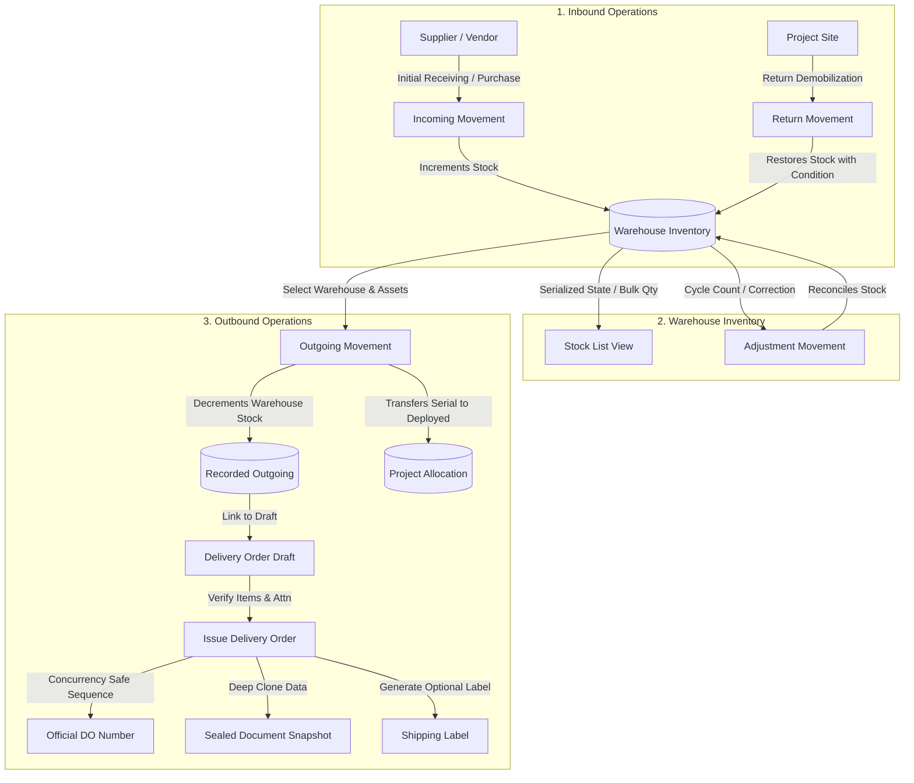

# AWMS — System Design Document

This document provides a comprehensive technical overview of the **Asset Warehouse Management System (AWMS)** developed for **PT ALSSA Corporindo**. It serves as an architectural reference for company IT maintenance, future development onboarding, and internship report verification.

---

## 1. System Overview

AWMS is an operational logistics and inventory execution platform. It replaces manual, error-prone spreadsheets with an integrated, auditable transactional ledger.

### Primary Objectives
- **Inventory & Asset Tracking**: Maintain authoritative stock levels across multiple geographical warehouse hubs, tracking both consumable bulk materials and high-value serialized assets.
- **Transactional Integrity**: Every inventory change is recorded as an immutable stock movement linked to an operator, location, date, and project destination.
- **Formal Delivery Execution**: Issue official Delivery Orders (DO) with concurrency-safe sequence counters and legal document snapshots.
- **Dispatch Labeling**: Generate standardized physical shipping labels formatted for warehouse packaging and dispatch.
- **Auditability & Reporting**: Maintain sanitized audit logs for critical actions and generate monthly operational Excel workbooks with structured summary sheets.

---

## 2. Technical Stack & High-Level Architecture

AWMS follows a decoupled client-server architecture with a PostgreSQL relational database.

```
┌─────────────────────────────────────────────────────────────┐
│                       Frontend Client                       │
│             React 19 • TypeScript • Vite • SPA              │
│       Shared UI Components • Scoped Styles • Contexts       │
└──────────────────────────────┬──────────────────────────────┘
                               │ HTTPS / JSON REST API
                               │ HttpOnly Session Cookies
┌──────────────────────────────▼──────────────────────────────┐
│                    Backend REST Service                     │
│                NestJS 11 • Node.js (LTS)                    │
│      Guards • Interceptors • Pipes • DTO Validation         │
└──────────────────────────────┬──────────────────────────────┘
                               │ Prisma Client (v7)
                               │ pg Connection Pool
┌──────────────────────────────▼──────────────────────────────┐
│                     Database Layer                          │
│                   PostgreSQL (15–17)                        │
│          Tables • Foreign Keys • Unique Constraints         │
└─────────────────────────────────────────────────────────────┘
```

### Technology Matrix
| Layer | Technology | Key Libraries & Rationale |
| :--- | :--- | :--- |
| **Frontend** | React 19, TypeScript, Vite | Fast HMR, strong compile-time types, `react-router-dom` v7 for layout-driven routing, `lucide-react` for icons, `html2pdf.js` for client-side document rendering. |
| **Backend** | NestJS 11, TypeScript | Modular architecture, dependency injection, class-validator/class-transformer DTO enforcement, `@nestjs/jwt` for stateless authentication, `exceljs` for multi-sheet workbook generation. |
| **Database & ORM** | PostgreSQL 17, Prisma ORM 7 | Relational schema integrity, foreign key cascades, migration management, and connection pooling via `@prisma/adapter-pg`. |

---

## 3. Application Workflows

AWMS structures logistics around physical movement stages and document handovers:



### Detailed Workflow Stages

1. **Incoming (Receiving)**
   - Operators record goods received from vendors or central purchasing into a target warehouse.
   - For bulk items, `warehouse_stocks.quantity` is incremented.
   - For serialized items, unique `item_serials` records are created or updated with state `STANDBY_GOOD` and assigned to the destination warehouse.

2. **Outgoing (Site Dispatch)**
   - Operators allocate stock from a single source warehouse to an active client project.
   - For bulk items, warehouse stock is decremented and project stock is incremented.
   - For serialized items, the serial's `currentWarehouseId` is cleared, `currentProjectId` is assigned, and state changes to `DEPLOY`.
   - Generates an Outgoing `StockMovement` transaction.

3. **Project Returns**
   - When project equipment is demobilized back to a warehouse, a `RETURN` movement is registered.
   - Operators inspect item condition (`STANDBY_GOOD`, `STANDBY_DEFECTIVE`, `SCRAP`, or custom condition note).
   - Serialized items return to `currentWarehouseId` with their inspected state; bulk quantities are re-credited.

4. **Stock Adjustments**
   - Used for discrepancy reconciliation (e.g. physical count audits, damaged in storage).
   - Records an immutable `ADJUSTMENT` movement ledger entry with before/after justification.

5. **Delivery Order (DO) Issuance**
   - Outgoing dispatches can be formalized into an official Delivery Order document.
   - A draft is created, reviewed, and then **Issued**.
   - Upon issuance, a unique sequence number is assigned (`XXX/ALS-[CITY]/DO-[CLIENT]/[MONTH]/[YEAR]`), and a complete historical snapshot is sealed.

6. **Shipping Labels**
   - Created either from an issued Delivery Order or standalone for independent courier packages.
   - Formatted to thermal label specifications (`100x150mm`) with fragile indicators and sender/recipient blocks.

---

## 4. Frontend Architecture

The frontend is located in `/frontend/src` and organized by separation of concerns:

```
frontend/src/
├── api/             # API client services & HTTP fetch wrappers
├── components/      # UI component hierarchy
│   ├── common/      # Domain modals & cross-cutting widgets (e.g. MonthlyReportModal, PageTitleUpdater)
│   ├── settings/    # Tab panels for system settings
│   ├── ui/          # Atomic shared UI design system (Button, Modal, FormField, etc.)
│   ├── DashboardLayout.tsx  # Application shell with responsive sidebar & user header
│   └── ProtectedRoute.tsx   # Client-side permission & authentication route guard
├── context/         # React Context providers (AuthContext, ToastContext)
├── pages/           # Route views organized by domain (Delivery/, Inventory/, etc.)
├── styles/          # Modular CSS stylesheets (variables.css, stock.css, delivery.css, etc.)
├── types/           # Global TypeScript definitions
└── utils/           # Helper utilities (datetime, permissions, exportWorkbook)
```

### Component Categories
- **Pages** (`src/pages/*`): High-level view controllers responsible for data fetching, URL query state, search filters, and orchestrating modals.
- **Domain Modals & Components** (`src/components/common/*`): Feature-specific dialogs (e.g. `MonthlyReportModal`, `AddIncomingModal`, `AdjustmentModal`, `DeliveryOrderDetailModal`).
- **Shared UI Library** (`src/components/ui/*`): Consistent, primitive components exportable from a single barrel (`Button`, `Card`, `Modal`, `FormField`, `Select`, `Input`, `StatusBadge`, `StepWizardModal`).
- **Styling Architecture**: Pure CSS design tokens (`src/styles/variables.css`) coupled with semantic stylesheets (`buttons.css`, `tables.css`, `delivery.css`, `print.css`). This avoids runtime CSS-in-JS overhead while keeping layout styles uniform.

---

## 5. Backend Architecture

The backend is built with NestJS in `/backend/src`, organized into modular feature domains:

```
backend/src/
├── app.module.ts              # Root application module orchestrating submodules
├── main.ts                    # Bootstrap entrypoint (CORS, validation pipes, cookies)
├── prisma.service.ts          # Central database connection manager with pg pool
├── common/                    # Cross-cutting decorators, filters, guards, interceptors
│   ├── decorators/            # @CurrentUser(), @Roles()
│   ├── filters/               # HttpExceptionFilter
│   ├── guards/                # RolesGuard
│   ├── helpers/               # Pagination utilities
│   └── interceptors/          # TransformInterceptor (standard JSON response envelope)
├── auth/                      # Authentication, bcrypt hashing, JWT issuance & cookie parsing
├── audit-logs/                # Immutable action auditing service
├── cities/                    # Master city reference data
├── customers/                 # Client and ClientContact management
├── dashboard/                 # Aggregated metrics, inventory health, KPI counts
├── delivery-orders/           # Delivery order lifecycle, sequential numbering, snapshots
├── exports/                   # Excel workbook generation (full export & monthly reports)
├── imports/                   # Excel data ingestion and validation
├── item-serials/              # Serialized unit status and history
├── items/                     # Master item catalog and categories
├── projects/                  # Client projects and site allocations
├── settings/                  # Global system configuration key-value storage
├── shipping-labels/           # Package shipping labels (standalone and DO-linked)
├── stock-movements/           # Transactional stock mutations (in, out, return, adjust)
├── stocks/                    # Read-optimized warehouse stock queries
├── units/                     # Measurement units master data
└── users/                     # User administration and role assignments
```

### Standard Request Lifecycle
1. Request hits Express, parses cookies via `cookie-parser`.
2. Global `AuthGuard` extracts JWT from `access_token` cookie, populates `request.user`.
3. `RolesGuard` evaluates controller/method `@Roles(...)` against user's role.
4. `ValidationPipe` validates and transforms incoming payload against DTO classes.
5. Controller delegates business logic to Service.
6. Service executes database queries inside Prisma interactive transactions (`tx`).
7. `TransformInterceptor` wraps successful payloads into `{ success: true, data: ... }`.
8. `HttpExceptionFilter` intercepts errors, returning standardized `{ success: false, message: ... }`.

---

## 6. Permission Model

AWMS implements Role-Based Access Control (RBAC) with three primary roles defined in the Prisma schema (`Role` enum) and enforced on both frontend and backend:

| Capability | SUPER_ADMIN | ADMIN | READ_ONLY | Notes |
| :--- | :---: | :---: | :---: | :--- |
| **View Dashboard** | ✅ | ✅ | ✅ | Standard operational metrics |
| **View Inventory & Movements** | ✅ | ✅ | ✅ | Read-only browsing across warehouses |
| **View Deliveries & Labels** | ✅ | ✅ | ✅ | Inspection of issued documentation |
| **View Master Data** | ✅ | ✅ | ✅ | Clients, Projects, Warehouses, Cities, Units |
| **Execute Stock Movements** | ✅ | ✅ | ❌ | Incoming, Outgoing, Return, Adjustments |
| **Manage Delivery Orders** | ✅ | ✅ | ❌ | Draft, edit, issue, and cancel drafts |
| **Manage Master Data** | ✅ | ✅ | ❌ | Add/edit clients, projects, items, units |
| **Generate Reports & Exports** | ✅ | ✅ | ❌ | Restricted to operational staff |
| **Manage Users** | ✅ | ❌ | ❌ | Creating/editing accounts, password resets |
| **Access System Settings** | ✅ | ❌ | ❌ | Company defaults, low-stock threshold |
| **View Activity Logs** | ✅ | ❌ | ❌ | Audit trail inspection |

---

## 7. Key Architectural Decisions (The "Why")

### 1. Why DeliveryOrder Uses Snapshot Fields
In business logistics, master data changes over time: a client changes company names, a project site code is updated, or an item model is revised.
- **Problem**: If Delivery Orders relied purely on foreign key joins, printing a 2-year-old Delivery Order would show the *current* client name rather than what was legally printed when the truck left the warehouse.
- **Decision**: When a DO is **Issued**, AWMS seals a full JSON snapshot (`snapshots` column) and flat historical snapshot columns (`clientCompanyName`, `attnName`, `projectName`, `warehouseName`). Old documents remain legally immutable regardless of future master data edits.

### 2. Why StockMovement Represents Every Inventory Change
- **Problem**: Directly incrementing or decrementing an `Item.quantity` table makes it impossible to know *who* changed stock, *when*, *why*, or *for which project*.
- **Decision**: Inventory stock balances are the result of transactional events. Every addition, dispatch, return, or reconciliation creates an immutable `StockMovement` row with line items and serial relations. The balance table (`warehouse_stocks`) acts as a cached projection of these events.

### 3. Why Shared UI Components Are Standardized
- **Decision**: The frontend avoids external heavyweight UI component suites (like MUI or AntD) in favor of lightweight, custom React primitives (`Button`, `Modal`, `Card`, `FormField`).
- **Benefit**: Ensures 100% control over design tokens, eliminates dependency bloat, reduces production bundle size (< 1.6 MB minified), and allows specialized print-friendly styles without CSS specificity conflicts.

### 4. Why Settings Were Separated From Master Data
- In earlier versions, reference data (such as Units and Cities) were nested under Settings tabs alongside system preferences.
- **Decision**: Information Architecture migration promoted **Units** and **Cities** to first-class Master Data views in the navigation sidebar. Settings is strictly reserved for administrative configurations (Company Profile, Inventory Thresholds). Master Data is accessible to both Admins and Read-Only users, preventing permission confusion.
