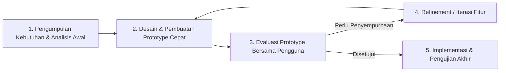

# BAB IV — Catatan Metodologi Pengembangan Sistem (AWMS)

Dokumen ini disusun sebagai panduan dan bahan referensi penyusunan **BAB IV (Metodologi Penelitian / Pengembangan Sistem)** pada Laporan Kerja Praktik (KP) di **PT ALSSA Corporindo**.

---

## 1. Metode Pengembangan Sistem: Prototyping Model

Pengembangan AWMS menggunakan model **Prototyping** iteratif yang adaptif. Karakteristik model ini sangat sesuai untuk lingkungan logistik pergudangan di mana kebutuhan operasional (format Delivery Order, penomoran sequence, verifikasi serial) terus dikonfirmasi secara langsung bersama staf administrasi logistik.

### Tahapan Pengembangan (Development Stages)
1. **Analisis Kebutuhan Awal (Requirements Gathering & Analysis)**
   - Mengidentifikasi kendala pada pencatatan logistik berbasis spreadsheet sebelumnya (duplikasi nomor DO, hilangnya riwayat mutasi, kesulitan pelacakan status unit serial).
   - Memetakan entitas master data utama: Klien (mitra), Gudang penyimpanan, Unit pengukuran, dan Proyek aktif.

2. **Perancangan Prototype Cepat (Quick Prototype Design)**
   - Merancang skema basis data relasional di PostgreSQL menggunakan Prisma ORM.
   - Membangun antarmuka awal menggunakan React 19 dan shared UI components untuk memastikan keterbacaan data stok dan formulir pengeluaran barang.

3. **Evaluasi Prototype (User Evaluation)**
   - Melakukan demonstrasi prototype kepada pembimbing lapangan / staf logistik PT ALSSA Corporindo.
   - Evaluasi difokuskan pada: kemudahan pemilihan serial number, keabsahan format nomor Delivery Order (`XXX/ALS-[CITY]/DO-[CLIENT]/[MONTH]/[YEAR]`), serta kesesuaian cetak fisik dokumen.

4. **Iterasi & Penghalusan Fitur (Refinement)**
   - Restrukturisasi *Information Architecture*: Memisahkan Unit dan Kota dari Pengaturan sistem menjadi Master Data mandiri.
   - Menambahkan penguncian snapshot historis (*document snapshot*) pada Delivery Order agar perubahan master data di masa depan tidak mengubah dokumen legal yang sudah terbit.
   - Mengimplementasikan filter tahun dinamis pada laporan bulanan untuk menghindari batas tahun *hardcoded*.

5. **Pengujian & Finalisasi (Final Verification & Delivery)**
   - Menjalankan automated test suite Jest pada backend (pengujian otentikasi, perizinan role, dan mutasi stok).
   - Verifikasi kompilasi TypeScript dan bundle production Vite.
   - Penyerahan dokumentasi teknis dan panduan operasional sistem (*Handover Guide*).

---

## 2. Metode Pengumpulan Data (Data Collection Methods)

Dalam menyusun laporan KP, sebutkan metode pengumpulan data empiris berikut:

1. **Wawancara (Interview)**
   - Wawancara langsung dengan Admin Logistik (Ibu Roberta Pungki) dan tim operasional lapangan mengenai alur penerimaan barang, pengiriman ke lokasi rig/proyek, dan kendala pelaporan bulanan.
2. **Observasi Lapangan (Observation)**
   - Pengamatan terhadap dokumen fisik Delivery Order, label pengiriman kemasan, dan format pencatatan nomor serial barang di gudang Balikpapan.
3. **Studi Dokumentasi (Document Study)**
   - Menganalisis arsip template Excel DO, laporan bulanan sebelumnya, dan aturan penomoran dokumen resmi PT ALSSA Corporindo.

---

## 3. Pendekatan Evaluasi & Pengujian (Evaluation Approach)

Sistem dievaluasi menggunakan dua pendekatan pengujian terukur:

1. **Automated Testing (White-box / Unit Testing)**
   - Pengujian unit backend menggunakan **Jest** (10 test suites, 47 test cases) untuk memvalidasi algoritma perizinan RBAC, pembuatan sequence tahunan DO yang aman dari *race condition*, dan validasi DTO masukan.
2. **Manual Functional Testing (Black-box Testing)**
   - Pengujian skenario menyeluruh (*end-to-end user scenario*):
     - Uji coba penerimaan barang masuk (`INCOMING`) dan verifikasi penambahan stok gudang.
     - Uji coba mutasi keluar (`OUTGOING`) dan verifikasi status serial berubah menjadi `DEPLOY`.
     - Uji coba penerbitan DO hingga pencetakan PDF/thermal label.
     - Uji coba akses multi-peran (`SUPER_ADMIN`, `ADMIN`, `READ_ONLY`).
